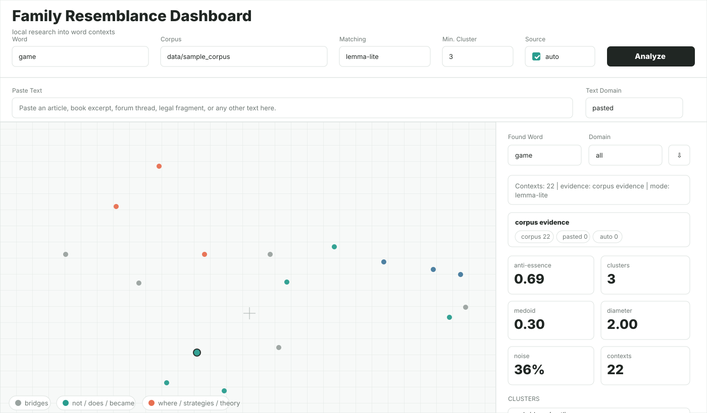

# Family Resemblance Word Map

Local research dashboard for exploring Wittgenstein's idea of family resemblance: abstract words do not have one fixed essence, but form networks of overlapping contextual uses.

The project runs locally and does not use third-party APIs. It can work with a text corpus, pasted text, and clearly marked locally generated auto-contexts.

## Features

- Analyze any word directly from the dashboard.
- Paste text into the dashboard without creating corpus files.
- Build contextual occurrence vectors with local PPMI + SVD and lexical-hash context features.
- Cluster meanings with a NumPy density algorithm inspired by HDBSCAN mutual reachability.
- Project contexts to a 2D semantic map with a local UMAP-like spectral layout.
- Auto-name clusters from characteristic context words.
- Show evidence level for each analysis:
  - `corpus evidence`
  - `pasted evidence`
  - `corpus + pasted evidence`
  - `hybrid evidence`
  - `synthetic only`
- Export JSON and generate a static HTML atlas.

## Quick Start

Use Python 3.11+.

```powershell
pip install -r requirements.txt
python scripts/dashboard.py
```

Open:

```text
http://127.0.0.1:8787/
```

In Codex's bundled runtime, the command can be:

```powershell
& "C:\Users\Shaim\.cache\codex-runtimes\codex-primary-runtime\dependencies\python\python.exe" scripts/dashboard.py
```

## Dashboard Preview



## Dashboard Workflow

1. Enter a word, for example `game`, `justice`, `knot`, `struggle`, or any other word.
2. Optionally paste your own text into `Paste Text`.
3. Choose a matching mode:
   - `lemma-lite` - default lightweight local form matching.
   - `exact` - exact token form only.
   - `prefix` - prefix matching.
4. Keep `auto` enabled if you want the dashboard to create local auto-contexts when there are too few real contexts.
5. Click `Analyze`.

The map will show contextual uses as points. Colors represent density clusters. Grey/noise points are bridges or outliers.

## Evidence Levels

The dashboard is explicit about the evidential status of a map:

- `corpus evidence` - only `.txt` files from the selected corpus folder.
- `pasted evidence` - only text pasted into the dashboard.
- `corpus + pasted evidence` - both real corpus files and pasted text.
- `hybrid evidence` - real contexts plus local auto-contexts.
- `synthetic only` - only local auto-contexts.

This distinction matters: synthetic-only maps are useful for exploration, but stronger research claims should be based on real corpus and pasted evidence.

## Static Atlas

Generate a static HTML/JSON report:

```powershell
python scripts/build_atlas.py --targets game justice knot --match-mode lemma-lite --auto-contexts
```

Outputs are written to `outputs/`:

- `family_map.html`
- `family_map.json`
- `analysis_report.md`

## Corpus Format

Put `.txt` files into a folder. The filename becomes the domain label.

Example:

```text
data/sample_corpus/
  science.txt
  fiction.txt
  forum.txt
  legal.txt
  politics.txt
```

Then run:

```powershell
python scripts/dashboard.py --corpus data/sample_corpus
```

or set the corpus path inside the dashboard.

## Project Structure

```text
scripts/
  dashboard.py      # local web dashboard
  build_atlas.py    # CLI static atlas generator
src/family_resemblance/
  text.py           # tokenization, matching, occurrence extraction
  embedding.py      # local PPMI + SVD contextual vectors
  density.py        # HDBSCAN-like density clustering
  reduction.py      # UMAP-like spectral projection
  metrics.py        # anti-essence and dispersion metrics
  labeling.py       # cluster names and evidence labels
  synthetic.py      # local auto-context generation
  pipeline.py       # end-to-end analysis pipeline
  export.py         # static HTML/JSON/Markdown export
data/sample_corpus/
  *.txt             # demo corpus domains
```

## No External API

The current implementation is fully local. It does not call OpenAI, Hugging Face, search engines, or any external service.

For higher-quality embeddings on a large corpus, you can later add locally installed transformer weights, but this repository intentionally keeps the default path offline and lightweight.

## Limitations

This is a research prototype, not a philosophical proof engine. The metrics provide mathematical evidence against a single-center meaning model, but interpretation still depends on corpus quality, domain coverage, and the distinction between real and synthetic contexts.
